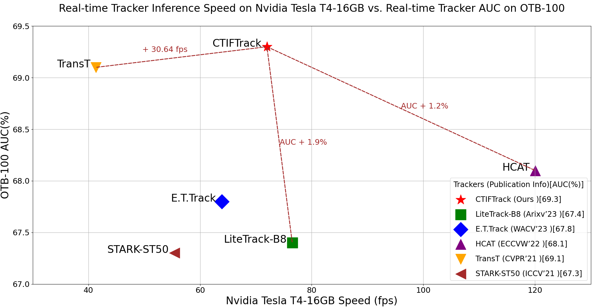

# CTIFTrack
"CTIFTrack: Continuous Temporal  Information Fusion for Object Track"
TODO list:
- [√] Release training and testing code.
- [√] Release our trained models.
## Performance


Highlight 1:TIF module:

lib.models.ctiftrack.TIF

Highlight 2:OTFR module:

lib.models.ctiftrack.vit_cae_async

<table class="tg">
<thead>
  <tr>
    <th class="tg-0pky"></th>
    <th class="tg-c3ow" colspan="3">Accuracy</th>
    <th class="tg-c3ow" colspan="5">FPS</th>
  </tr>
</thead>
<tbody>
  <tr>
    <td class="tg-0pky"></td>
    <td class="tg-c3ow">GOT-10k</td>
    <td class="tg-c3ow">LaSOT</td>
    <td class="tg-c3ow">TrackingNet</td>
    <td class="tg-c3ow"> Nvidia Tesla T4-16GB</td>
    
  </tr>
  <tr>
    <td class="tg-0pky">ctiftrack</td>
    <td class="tg-c3ow">71.3</td>
    <td class="tg-c3ow">66.9</td>
    <td class="tg-c3ow">82.3</td>
    <td class="tg-c3ow">71.98</td>

  </tr>
  
</tbody>
</table>

## Prepare Environment

Ensure that you have install the `pytorch` >= 1.8.1 and corresponding `torchvision` version.  It doesn't matter whether you use pip or conda.

Then execute
```sh
bash install.sh
```
You can check the script where I install the `opencv-python-headless` library because of my headless server environment.  If you are running in a machine with GUI, you can comment that out.

## Set project paths
Run the following command to set paths for this project
```
python tracking/create_default_local_file.py --workspace_dir . --data_dir ./data --save_dir ./output
```
After running this command, you can also modify paths by editing these two files
```
lib/train/admin/local.py  # paths about training
lib/test/evaluation/local.py  # paths about testing
```

## Training and Evaluation on Datasets
We support training following [OSTrack](https://github.com/botaoye/OSTrack).
### Dataset Preparation
Put the tracking datasets in ./data. It should look like this:
```
${PROJECT_ROOT}
 -- data
     -- lasot
         |-- airplane
         |-- basketball
         |-- bear
         ...
     -- got10k
         |-- test
         |-- train
         |-- val
     -- coco
         |-- annotations
         |-- images
     -- trackingnet
         |-- TRAIN_0
         |-- TRAIN_1
         ...
         |-- TRAIN_11
         |-- TEST
``` 
### Training
Download pre-trained [CAE ViT-Base weights](https://github.com/lxtGH/CAE)(cae_base.pth) and put it under  `$PROJECT_ROOT$/pretrained_models`.   
> **NOTE**: ViT in CAE is slightly different from the original ones (in Image is worth 16x16 words and MAE), e.g., projections of Q,K,V and layer scale.  Details can be seen in the code.

Run the command below to train the model:
```sh
````training on (trackingnet,lasot,coco,got10k)
python tracking/train.py --script ctiftrack --config B8_cae_center_all_ep300 --save_dir ./output --mode single  --use_wandb 0

````training on got10k,one shot
python tracking/train.py --script ctiftrack --config B8_cae_center_got10k_ep100 --save_dir ./output --mode single  --use_wandb 0

### Evaluation
Use your own training weights or ours([BaiduNetdisk:ctif](https://pan.baidu.com/s/1lN18GouRqafsI8YaLHx4fg?pwd=ctif) or [Google Drive](https://drive.google.com/drive/folders/1PaqcoZP6gi9i9WnAR4EcgtP7UpiggD-D?usp=drive_link) in `$PROJECT_ROOT$/output`.  
Some testing examples:

- LaSOT
```sh
python tracking/test.py ctiftrack B8_cae_center_all_ep300 --dataset lasot --threads 8 --num_gpus 1 --ep 299 300
python tracking/analysis_results.py # need to modify tracker configs and names
```
For other off-line evaluated benchmarks, modify --dataset correspondingly.

- GOT10K-test 
```sh
python tracking/test.py ctiftrack B8_cae_center_got10k_ep100 --dataset got10k_test --threads 8 --num_gpus 1 --ep 99 100
python lib/test/utils/transform_got10k.py --tracker_name ctiftrack --cfg_name B8_cae_center_got10k_ep100_100 # the last number is epoch
```
- TrackingNet 
```sh
python tracking/test.py ctiftrack B8_cae_center_all_ep300 --dataset trackingnet --threads 8 --num_gpus 1 --ep 299 300
python lib/test/utils/transform_trackingnet.py --tracker_name ctiftrack --cfg_name B8_cae_center_all_ep300_300 # the last number is epoch
```
## Acknowledgement
Our code is built upon [LiteTrack](https://github.com/TsingWei/LiteTrack). Also grateful for PyTracking.
